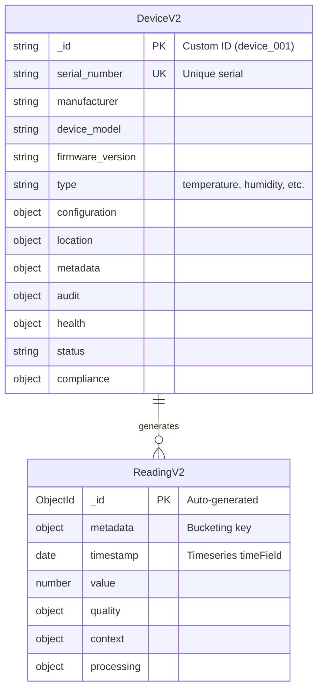

# Infrasight V2 Data Models Documentation

Complete data model reference for the Infrasight V2 IoT sensor monitoring system.

## Table of Contents

- [Overview](#overview)
- [Entity Relationship Diagram](#entity-relationship-diagram)
- [DeviceV2 Model](#devicev2-model)
  - [Schema Definition](#devicev2-schema-definition)
  - [Sub-Schemas](#devicev2-sub-schemas)
  - [Indexes](#devicev2-indexes)
  - [Static Methods](#devicev2-static-methods)
  - [Middleware](#devicev2-middleware)
- [ReadingV2 Model](#readingv2-model)
  - [Timeseries Configuration](#timeseries-configuration)
  - [Schema Definition](#readingv2-schema-definition)
  - [Metadata Constraints](#metadata-constraints)
  - [Indexes](#readingv2-indexes)
  - [Static Methods](#readingv2-static-methods)
- [Validation Schemas (Zod)](#validation-schemas-zod)
  - [Device Validation](#device-validation)
  - [Reading Validation](#reading-validation)
- [Relationships](#relationships)
- [Schema Constraints](#schema-constraints)
- [Migration Considerations](#migration-considerations)
- [Best Practices](#best-practices)

---

## Overview

Infrasight V2 uses MongoDB with Mongoose ODM for data persistence. The system consists of two primary collections:

| Collection    | Model     | Type       | Purpose                           |
| ------------- | --------- | ---------- | --------------------------------- |
| `devices_v2`  | DeviceV2  | Standard   | Device registry with audit trails |
| `readings_v2` | ReadingV2 | Timeseries | Sensor readings with 90-day TTL   |

### Key Characteristics

- **Custom Device IDs**: Devices use custom string IDs (e.g., `device_001`) instead of MongoDB ObjectIds
- **Soft Deletes**: Devices support soft deletion via `audit.deleted_at`
- **Timeseries Collections**: Readings use MongoDB's native timeseries collection feature
- **Audit Trails**: Complete change tracking on devices
- **90-Day TTL**: Readings automatically expire after 90 days

---

## Entity Relationship Diagram



---

## DeviceV2 Model

**Collection**: `devices_v2`

**Location**: `models/v2/DeviceV2.ts`

### DeviceV2 Schema Definition

```typescript
interface IDeviceV2 {
  _id: string; // Custom ID (e.g., "device_001")
  serial_number: string; // Unique serial number
  manufacturer: string; // Device manufacturer
  device_model: string; // Model name (NOT "model" - reserved)
  firmware_version: string; // Current firmware version
  type: DeviceType; // Sensor type
  configuration: IDeviceConfiguration;
  location: IDeviceLocation;
  metadata: IDeviceMetadata;
  audit: IDeviceAudit;
  health: IDeviceHealth;
  status: DeviceStatus;
  status_reason?: string;
  compliance: IDeviceCompliance;
}
```

### DeviceV2 Field Reference

| Field              | Type         | Required | Default                           | Description                           |
| ------------------ | ------------ | -------- | --------------------------------- | ------------------------------------- |
| `_id`              | string       | Yes      | -                                 | Custom device ID (e.g., `device_001`) |
| `serial_number`    | string       | Yes      | -                                 | Unique serial number (indexed)        |
| `manufacturer`     | string       | Yes      | -                                 | Device manufacturer                   |
| `device_model`     | string       | Yes      | -                                 | Device model name                     |
| `firmware_version` | string       | Yes      | -                                 | Firmware version string               |
| `type`             | DeviceType   | Yes      | -                                 | Sensor/device type                    |
| `configuration`    | object       | Yes      | -                                 | Thresholds and calibration            |
| `location`         | object       | Yes      | -                                 | Physical location                     |
| `metadata`         | object       | No       | `{tags:[], department:'unknown'}` | Operational metadata                  |
| `audit`            | object       | No       | Auto-generated                    | Audit trail                           |
| `health`           | object       | No       | Auto-generated                    | Health metrics                        |
| `status`           | DeviceStatus | No       | `active`                          | Current status                        |
| `status_reason`    | string       | No       | -                                 | Reason for status                     |
| `compliance`       | object       | No       | Defaults                          | Compliance settings                   |

### Device Types

```typescript
type DeviceType =
  | 'temperature'
  | 'humidity'
  | 'occupancy'
  | 'power'
  | 'co2'
  | 'pressure'
  | 'light'
  | 'motion'
  | 'air_quality'
  | 'water_flow'
  | 'gas'
  | 'vibration'
  | 'voltage'
  | 'current'
  | 'energy';
```

### Device Status

```typescript
type DeviceStatus =
  | 'active' // Device is operational
  | 'maintenance' // Under maintenance
  | 'offline' // Not responding
  | 'decommissioned' // Retired (soft deleted)
  | 'error'; // Has errors
```

### DeviceV2 Sub-Schemas

#### Configuration

```typescript
interface IDeviceConfiguration {
  threshold_warning: number; // Warning threshold value
  threshold_critical: number; // Critical threshold value
  sampling_interval: number; // Sampling interval in seconds (default: 60)
  calibration_date: Date | null; // Last calibration date
  calibration_offset: number; // Calibration offset (default: 0)
}
```

#### Location

```typescript
interface IDeviceLocation {
  building_id: string; // Building identifier
  floor: number; // Floor number
  room_name: string; // Room name
  coordinates?: {
    // Optional coordinates
    x: number;
    y: number;
    z?: number;
  };
  zone?: string; // Optional zone/area
}
```

#### Metadata

```typescript
interface IDeviceMetadata {
  tags: string[]; // Searchable tags
  department: string; // Department (default: 'unknown')
  cost_center?: string; // Cost center code
  warranty_expiry?: Date; // Warranty expiration
  last_maintenance?: Date; // Last maintenance date
  next_maintenance?: Date; // Next scheduled maintenance
}
```

#### Audit

```typescript
interface IDeviceAudit {
  created_at: Date; // Creation timestamp
  created_by: string; // Creator identifier
  updated_at: Date; // Last update timestamp
  updated_by: string; // Updater identifier
  deleted_at?: Date; // Soft delete timestamp
  deleted_by?: string; // Who deleted
}
```

#### Health

```typescript
interface IDeviceHealth {
  last_seen: Date; // Last communication
  uptime_percentage: number; // Uptime % (0-100)
  error_count: number; // Total error count
  last_error?: {
    timestamp: Date;
    message: string;
    code: string;
  };
  battery_level?: number; // Battery % (0-100)
  signal_strength?: number; // Signal strength (dBm)
}
```

#### Compliance

```typescript
interface IDeviceCompliance {
  requires_encryption: boolean; // Data encryption required (default: false)
  data_classification: 'public' | 'internal' | 'confidential' | 'restricted';
  retention_days: number; // Data retention period (default: 90)
}
```

### DeviceV2 Indexes

```typescript
// Compound index for location-based queries
{ 'location.building_id': 1, 'location.floor': 1 }

// Status filtering
{ status: 1 }

// Health monitoring (offline detection)
{ 'health.last_seen': 1 }

// Soft delete queries
{ 'audit.deleted_at': 1 }

// Department filtering
{ 'metadata.department': 1 }

// Manufacturer filtering
{ manufacturer: 1 }

// Combined status + type queries
{ status: 1, type: 1 }

// Serial number (unique)
{ serial_number: 1 } // unique: true
```

### DeviceV2 Static Methods

```typescript
// Find all non-deleted devices
DeviceV2.findActive(filter?: object): Query

// Find only soft-deleted devices
DeviceV2.findDeleted(filter?: object): Query

// Soft delete a device
DeviceV2.softDelete(id: string, deletedBy?: string): Promise<IDeviceV2 | null>

// Restore a soft-deleted device
DeviceV2.restore(id: string): Promise<IDeviceV2 | null>
```

#### Usage Examples

```typescript
// Find all active devices on floor 1
const devices = await DeviceV2.findActive({ 'location.floor': 1 });

// Soft delete a device
await DeviceV2.softDelete('device_001', 'admin@example.com');

// Restore a deleted device
await DeviceV2.restore('device_001');

// Find deleted devices
const deleted = await DeviceV2.findDeleted();
```

### DeviceV2 Middleware

```typescript
// Pre-save: Updates audit.updated_at on modifications
DeviceV2Schema.pre('save', function () {
  if (!this.isNew) {
    this.audit.updated_at = new Date();
  }
});

// Pre-findOneAndUpdate: Updates audit.updated_at
DeviceV2Schema.pre('findOneAndUpdate', function () {
  this.set({ 'audit.updated_at': new Date() });
});
```

---

## ReadingV2 Model

**Collection**: `readings_v2` (MongoDB Timeseries)

**Location**: `models/v2/ReadingV2.ts`

### Timeseries Configuration

```typescript
{
  collection: 'readings_v2',
  timeseries: {
    timeField: 'timestamp',      // Required: Primary time field
    metaField: 'metadata',       // Required: Bucketing key
    granularity: 'seconds'       // Optimization hint
  },
  expireAfterSeconds: 7776000    // 90-day TTL
}
```

> **WARNING**: Timeseries collection configuration cannot be changed after creation. Modifying `timeField`, `metaField`, or `granularity` requires recreating the collection.

### ReadingV2 Schema Definition

```typescript
interface IReadingV2 extends Document {
  metadata: IReadingMetadata; // Bucketing key (LOW CARDINALITY)
  timestamp: Date; // Reading timestamp
  value: number; // Measurement value
  quality: IReadingQuality; // Data quality metrics
  context?: IReadingContext; // Environmental context
  processing: IReadingProcessing; // Processing metadata
}
```

### ReadingV2 Field Reference

| Field        | Type   | Required | Description                   |
| ------------ | ------ | -------- | ----------------------------- |
| `metadata`   | object | Yes      | Bucketing key for timeseries  |
| `timestamp`  | Date   | Yes      | Reading timestamp (timeField) |
| `value`      | number | Yes      | Measurement value             |
| `quality`    | object | No       | Data quality indicators       |
| `context`    | object | No       | Environmental context         |
| `processing` | object | No       | Processing metadata           |

### ReadingV2 Sub-Schemas

#### Metadata (Bucketing Key)

```typescript
interface IReadingMetadata {
  device_id: string; // Device identifier
  type: ReadingType; // Reading type
  unit: ReadingUnit; // Measurement unit
  source: ReadingSource; // Data source
}
```

> **CRITICAL**: Keep metadata fields to LOW CARDINALITY values only. High cardinality metadata causes poor timeseries performance.

#### Reading Types

```typescript
type ReadingType =
  | 'temperature'
  | 'humidity'
  | 'occupancy'
  | 'power'
  | 'co2'
  | 'pressure'
  | 'light'
  | 'motion'
  | 'air_quality'
  | 'water_flow'
  | 'gas'
  | 'vibration'
  | 'voltage'
  | 'current'
  | 'energy';
```

#### Reading Units

```typescript
type ReadingUnit =
  // Temperature
  | 'celsius'
  | 'fahrenheit'
  | 'kelvin'
  // Percentage
  | 'percent'
  // Gas/Air quality
  | 'ppm'
  | 'ppb'
  | 'ug_m3'
  // Pressure
  | 'pascal'
  | 'hpa'
  | 'bar'
  | 'psi'
  // Power/Energy
  | 'watts'
  | 'kilowatts'
  | 'watt_hours'
  | 'kilowatt_hours'
  // Electrical
  | 'volts'
  | 'millivolts'
  | 'amperes'
  | 'milliamperes'
  // Light
  | 'lux'
  | 'lumens'
  // Flow
  | 'liters_per_minute'
  | 'gallons_per_minute'
  | 'cubic_meters_per_hour'
  // Count/Boolean
  | 'count'
  | 'boolean'
  // Generic
  | 'raw'
  | 'unknown';
```

#### Reading Sources

```typescript
type ReadingSource = 'sensor' | 'simulation' | 'manual' | 'calibration';
```

#### Quality

```typescript
interface IReadingQuality {
  is_valid: boolean; // Passed validation (default: true)
  confidence_score?: number; // 0-1 confidence score
  validation_flags?: string[]; // Validation issues
  is_anomaly: boolean; // Anomaly flag (default: false)
  anomaly_score?: number; // 0-1 anomaly score
}
```

#### Context

```typescript
interface IReadingContext {
  battery_level?: number; // Device battery at reading time
  signal_strength?: number; // Signal strength at reading time
  ambient_temp?: number; // Ambient temperature for calibration
}
```

#### Processing

```typescript
interface IReadingProcessing {
  raw_value?: number; // Original uncalibrated value
  calibration_offset?: number; // Calibration offset applied
  ingested_at: Date; // Server ingestion timestamp
}
```

### Metadata Constraints

The `metadata` field is the bucketing key for MongoDB's timeseries collection. **Keep it LOW CARDINALITY**:

| Field       | Cardinality | Notes              |
| ----------- | ----------- | ------------------ |
| `device_id` | Medium      | ~500 unique values |
| `type`      | Low         | ~15 enum values    |
| `unit`      | Low         | ~25 enum values    |
| `source`    | Very Low    | 4 enum values      |

> **DO NOT ADD** high-cardinality fields like timestamps, UUIDs, or free-text to metadata.

### ReadingV2 Indexes

```typescript
// Device + timestamp queries (most common)
{ 'metadata.device_id': 1, timestamp: -1 }

// Anomaly queries
{ 'quality.is_anomaly': 1, timestamp: -1 }

// Source filtering
{ 'metadata.source': 1 }

// Type-based queries
{ 'metadata.type': 1, timestamp: -1 }

// Validity filtering with device
{ 'quality.is_valid': 1, 'metadata.device_id': 1 }
```

> **Note**: MongoDB automatically creates indexes on `timeField` and `metaField` for timeseries collections.

### ReadingV2 Static Methods

```typescript
// Get latest reading for a device
ReadingV2.getLatestForDevice(
  deviceId: string,
  type?: ReadingType
): Query

// Get readings in time range
ReadingV2.getForDeviceInRange(
  deviceId: string,
  startTime: Date,
  endTime: Date,
  options?: {
    type?: ReadingType;
    limit?: number;
    includeInvalid?: boolean;
  }
): Query

// Get anomalous readings
ReadingV2.getAnomalies(
  deviceId?: string,
  options?: {
    startTime?: Date;
    endTime?: Date;
    minScore?: number;
    limit?: number;
  }
): Query

// Bulk insert readings
ReadingV2.bulkInsertReadings(
  readings: Array<Partial<IReadingV2>>
): Promise<IReadingV2[]>
```

#### Usage Examples

```typescript
// Get latest temperature reading
const latest = await ReadingV2.getLatestForDevice('device_001', 'temperature');

// Get readings for last hour
const readings = await ReadingV2.getForDeviceInRange(
  'device_001',
  new Date(Date.now() - 3600000),
  new Date(),
  { limit: 100 }
);

// Get high-score anomalies
const anomalies = await ReadingV2.getAnomalies(undefined, {
  startTime: new Date(Date.now() - 86400000),
  minScore: 0.8,
  limit: 50,
});

// Bulk insert
await ReadingV2.bulkInsertReadings([
  {
    metadata: { device_id: 'device_001', type: 'temperature', unit: 'celsius', source: 'sensor' },
    timestamp: new Date(),
    value: 22.5,
  },
]);
```

---

## Validation Schemas (Zod)

All API inputs are validated using Zod schemas located in `lib/validations/v2/`.

### Device Validation

**Location**: `lib/validations/v2/device.validation.ts`

#### Create Device Schema

```typescript
const createDeviceSchema = z.object({
  _id: deviceIdSchema, // Required: Custom ID
  serial_number: serialNumberSchema, // Required: Unique serial
  manufacturer: manufacturerSchema, // Required
  device_model: modelNameSchema, // Required
  firmware_version: firmwareVersionSchema, // Required
  type: deviceTypeSchema, // Required: Enum
  configuration: deviceConfigurationSchema, // Required
  location: deviceLocationSchema, // Required
  metadata: deviceMetadataSchema.optional(),
  status: deviceStatusSchema.default('active'),
  status_reason: z.string().max(200).optional(),
  compliance: deviceComplianceSchema.optional(),
  health: deviceHealthSchema.optional(),
  audit: deviceAuditSchema.optional(),
});
```

#### Update Device Schema

```typescript
const updateDeviceSchema = z
  .object({
    serial_number: serialNumberSchema.optional(),
    manufacturer: manufacturerSchema.optional(),
    device_model: modelNameSchema.optional(),
    firmware_version: firmwareVersionSchema.optional(),
    configuration: deviceConfigurationSchema.partial().optional(),
    location: deviceLocationSchema.partial().optional(),
    metadata: deviceMetadataSchema.partial().optional(),
    status: deviceStatusSchema.optional(),
    status_reason: z.string().max(200).optional(),
    compliance: deviceComplianceSchema.partial().optional(),
    health: deviceHealthSchema.partial().optional(),
  })
  .refine(data => Object.keys(data).length > 0, 'At least one field must be provided for update');
```

#### List Devices Query Schema

```typescript
const listDevicesQuerySchema = z.object({
  // Pagination
  page: z.number().int().min(1).default(1),
  limit: z.number().int().min(1).max(100).default(20),

  // Sorting
  sortBy: z.enum(['created_at', 'updated_at', 'last_seen', ...]).optional(),
  sortDirection: z.enum(['asc', 'desc']).default('desc'),

  // Filters
  status: z.union([deviceStatusSchema, z.array(deviceStatusSchema)]).optional(),
  type: z.union([deviceTypeSchema, z.array(deviceTypeSchema)]).optional(),
  building_id: buildingIdSchema.optional(),
  floor: floorSchema.optional(),
  zone: zoneSchema.optional(),
  department: departmentSchema.optional(),
  tags: z.union([z.array(z.string()), z.string()]).optional(),
  manufacturer: manufacturerSchema.optional(),

  // Health filters
  min_battery: z.number().optional(),
  max_battery: z.number().optional(),
  offline_threshold_minutes: z.number().default(5),

  // Soft delete filters
  include_deleted: z.boolean().default(false),
  only_deleted: z.boolean().default(false),

  // Date range
  startDate: z.string().datetime().optional(),
  endDate: z.string().datetime().optional(),
  date_filter_field: z.enum(['created_at', 'updated_at', 'last_seen']).optional(),

  // Field projection
  fields: z.string().transform(v => v.split(',')).optional(),

  // Search
  search: z.string().max(100).optional()
});
```

### Reading Validation

**Location**: `lib/validations/v2/reading.validation.ts`

#### Create Reading Schema

```typescript
const createReadingSchema = z.object({
  metadata: readingMetadataSchema, // Required
  timestamp: pastDateSchema, // Required: Cannot be future
  value: z.number(), // Required
  quality: readingQualitySchema.optional(),
  context: readingContextSchema.optional(),
  processing: readingProcessingSchema.optional(),
});
```

#### Bulk Ingest Schema

```typescript
const bulkIngestReadingsSchema = z.object({
  readings: z
    .array(bulkReadingItemSchema)
    .min(1, 'At least one reading is required')
    .max(10000, 'Cannot ingest more than 10,000 readings at once'),
  idempotency_key: z.string().uuid().optional(),
  batch_source: z.string().max(100).optional(),
});

const bulkReadingItemSchema = z.object({
  device_id: deviceIdSchema, // Required
  type: readingTypeSchema, // Required
  unit: readingUnitSchema.optional(), // Auto-detected if omitted
  source: readingSourceSchema.default('sensor'),
  timestamp: z.union([z.date(), z.string().datetime(), z.number()]),
  value: z.number(),
  confidence_score: confidenceScoreSchema.optional(),
  battery_level: batteryLevelSchema.optional(),
  signal_strength: signalStrengthSchema.optional(),
  raw_value: z.number().optional(),
  calibration_offset: z.number().optional(),
});
```

#### List Readings Query Schema

```typescript
const listReadingsQuerySchema = z
  .object({
    // Pagination
    page: z.number().int().min(1).default(1),
    limit: z.number().int().min(1).max(100).default(20),

    // Sorting
    sortBy: z.enum(['timestamp', 'value', 'anomaly_score', 'confidence_score']).optional(),
    sortDirection: z.enum(['asc', 'desc']).default('desc'),

    // Filters
    device_id: z.union([deviceIdSchema, z.array(deviceIdSchema)]).optional(),
    type: z.union([readingTypeSchema, z.array(readingTypeSchema)]).optional(),
    source: z.union([readingSourceSchema, z.array(readingSourceSchema)]).optional(),

    // Time range
    startDate: z.string().datetime().optional(),
    endDate: z.string().datetime().optional(),

    // Quality filters
    is_valid: z.boolean().optional(),
    is_anomaly: z.boolean().optional(),
    min_confidence: z.number().optional(),
    min_anomaly_score: z.number().optional(),

    // Value range
    min_value: z.number().optional(),
    max_value: z.number().optional(),

    // Field projection
    fields: z
      .string()
      .transform(v => v.split(','))
      .optional(),
  })
  .refine(
    data => data.device_id || data.startDate,
    'Either device_id or startDate must be provided'
  );
```

---

## Relationships

### Device to Readings (1:N)

Devices are linked to readings via `metadata.device_id`:

```typescript
// Get all readings for a device
const readings = await ReadingV2.find({
  'metadata.device_id': device._id,
});

// Get device for a reading
const device = await DeviceV2.findById(reading.metadata.device_id);
```

### Device to Audit Trail (Embedded)

Audit information is embedded in the device document:

```typescript
// Access audit trail
const created = device.audit.created_at;
const createdBy = device.audit.created_by;
const isDeleted = !!device.audit.deleted_at;
```

---

## Schema Constraints

### Immutable Fields

These fields cannot be changed after document creation:

**DeviceV2**:

- `_id` - Custom device ID
- `audit.created_at` - Creation timestamp
- `audit.created_by` - Creator identifier

**ReadingV2**:

- All fields in `metadata` (timeseries bucketing key)
- `timestamp` (timeseries timeField)

### Timeseries Limitations

1. **Cannot modify timeseries configuration**: Changes to `timeField`, `metaField`, or `granularity` require recreating the collection

2. **Metadata cardinality matters**: High-cardinality metadata degrades performance

3. **No document updates**: Timeseries documents cannot be updated (only inserted)

4. **Limited delete operations**: Bulk deletes only; no single-document deletes

### Unique Constraints

| Collection  | Field           | Constraint                       |
| ----------- | --------------- | -------------------------------- |
| devices_v2  | `_id`           | Unique (custom string ID)        |
| devices_v2  | `serial_number` | Unique                           |
| readings_v2 | `_id`           | Unique (auto-generated ObjectId) |

---

## Migration Considerations

### V1 to V2 Field Mappings

| V1 Field   | V2 Field            | Notes                                                       |
| ---------- | ------------------- | ----------------------------------------------------------- |
| `location` | `location` (nested) | Now structured: `building_id`, `floor`, `room_name`, `zone` |
| `type`     | `type`              | Same                                                        |
| `model`    | `device_model`      | Renamed (avoid Mongoose conflict)                           |
| `status`   | `status`            | Same enum values                                            |
| N/A        | `serial_number`     | New required field                                          |
| N/A        | `manufacturer`      | New required field                                          |
| N/A        | `health`            | New nested object                                           |
| N/A        | `compliance`        | New nested object                                           |
| `lastSeen` | `health.last_seen`  | Moved to health sub-document                                |
| N/A        | `audit`             | New audit trail                                             |

### Migration Steps

1. **Create new collections**: Create `devices_v2` and `readings_v2`
2. **Create indexes**: Run `pnpm create-indexes-v2`
3. **Migrate devices**: Transform and insert devices with new schema
4. **Generate serial numbers**: Auto-generate for devices missing serial numbers
5. **Set defaults**: Apply default values for new required fields
6. **Migrate readings**: Transform to timeseries format with metadata

### Default Values for Migration

```typescript
// Device defaults
{
  serial_number: `SN-${device._id}`,           // Auto-generate from ID
  manufacturer: 'Unknown',
  health: {
    last_seen: device.lastSeen || new Date(),
    uptime_percentage: 100,
    error_count: 0
  },
  compliance: {
    requires_encryption: false,
    data_classification: 'internal',
    retention_days: 90
  },
  audit: {
    created_at: device.createdAt || new Date(),
    created_by: 'sys-migration-agent',
    updated_at: new Date(),
    updated_by: 'sys-migration-agent'
  }
}
```

---

## Best Practices

### Creating Devices

```typescript
// Always use custom string ID
const device = await DeviceV2.create({
  _id: 'device_501', // NOT: new mongoose.Types.ObjectId()
  serial_number: 'SN-2026-501',
  // ... other fields
});
```

### Querying Active Devices

```typescript
// Use findActive() to exclude soft-deleted devices
const devices = await DeviceV2.findActive({ status: 'active' });

// Or manually filter
const devices = await DeviceV2.find({
  status: 'active',
  'audit.deleted_at': { $exists: false },
});
```

### Querying Readings Efficiently

```typescript
// Always include device_id OR time range to use indexes
const readings = await ReadingV2.find({
  'metadata.device_id': 'device_001',
  timestamp: {
    $gte: new Date('2026-01-01'),
    $lte: new Date('2026-01-02'),
  },
}).sort({ timestamp: -1 });

// Use maxTimeMS to prevent long-running queries
const readings = await ReadingV2.find(query).maxTimeMS(5000);
```

### Bulk Ingesting Readings

```typescript
// Process in batches to avoid memory issues
const BATCH_SIZE = 100;
for (let i = 0; i < readings.length; i += BATCH_SIZE) {
  const batch = readings.slice(i, i + BATCH_SIZE);
  await ReadingV2.insertMany(batch, { ordered: false });
}
```

### Avoiding Mongoose Model Recompilation

```typescript
// Always check mongoose.models before creating model
const DeviceV2 =
  (mongoose.models.DeviceV2 as IDeviceV2Model) ||
  mongoose.model<IDeviceV2, IDeviceV2Model>('DeviceV2', DeviceV2Schema);
```

### Handling Timestamps

```typescript
// Readings: Use Date objects or ISO strings
{
  timestamp: new Date(),                    // Best
  timestamp: '2026-01-05T12:00:00.000Z',   // Also valid
  timestamp: 1735996800000                  // Unix ms (converted in validation)
}

// Devices: Audit timestamps are auto-managed
// Don't set audit.updated_at manually - middleware handles it
```

---

## Query Examples

### Complex Device Queries

```typescript
// Find offline devices with low battery
const criticalDevices = await DeviceV2.findActive({
  $and: [
    { 'health.last_seen': { $lt: new Date(Date.now() - 5 * 60 * 1000) } },
    { 'health.battery_level': { $lt: 20 } },
  ],
});

// Search devices by tag and department
const devices = await DeviceV2.findActive({
  'metadata.tags': { $in: ['hvac', 'critical'] },
  'metadata.department': 'facilities',
});
```

### Aggregation Queries

```typescript
// Device count by status
const statusCounts = await DeviceV2.aggregate([
  { $match: { 'audit.deleted_at': { $exists: false } } },
  { $group: { _id: '$status', count: { $sum: 1 } } },
]);

// Average reading value by type
const avgByType = await ReadingV2.aggregate([
  { $match: { 'quality.is_valid': true } },
  { $group: { _id: '$metadata.type', avg: { $avg: '$value' } } },
]);

// Anomaly trends by hour
const trends = await ReadingV2.aggregate([
  { $match: { 'quality.is_anomaly': true } },
  {
    $group: {
      _id: { $dateToString: { format: '%Y-%m-%dT%H:00:00', date: '$timestamp' } },
      count: { $sum: 1 },
      avg_score: { $avg: '$quality.anomaly_score' },
    },
  },
  { $sort: { _id: 1 } },
]);
```

---

_Last Updated: 2026-01-05_
